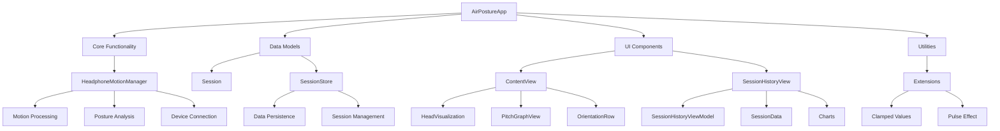

# AirPosture Codebase Structure

## Component Descriptions

### Core Functionality
- **HeadphoneMotionManager**: Central class for motion data processing
  - Motion Processing: Handles raw sensor data
  - Posture Analysis: Calculates posture metrics
  - Device Connection: Manages AirPods connectivity

### Data Models
- **Session**: Represents a tracking session
- **SessionStore**: Manages session persistence and retrieval

### UI Components
- **ContentView**: Main application screen
  - HeadVisualization: 3D head representation
  - PitchGraphView: Posture timeline visualization
  - OrientationRow: Axis value displays
  
- **SessionHistoryView**: Historical data presentation
  - ViewModel: Handles data processing
  - Charts: Visualizes session metrics

### Utilities
- **Extensions**: Helper functionality
  - Clamped Values: Ensures values stay within ranges
  - Pulse Effect: Visual alert animation