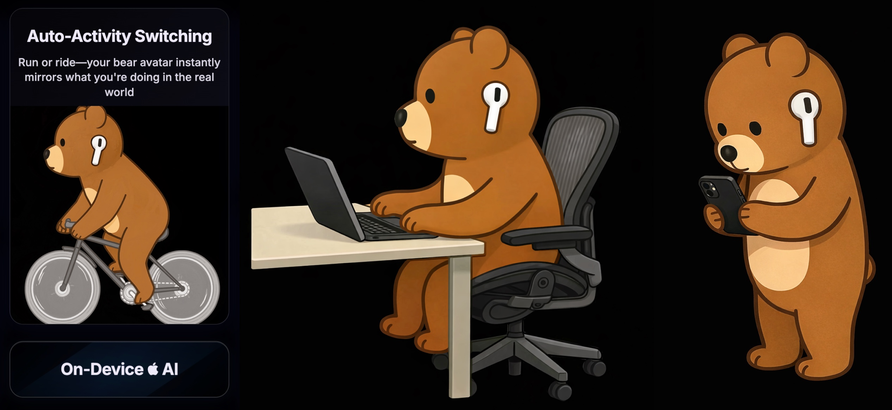
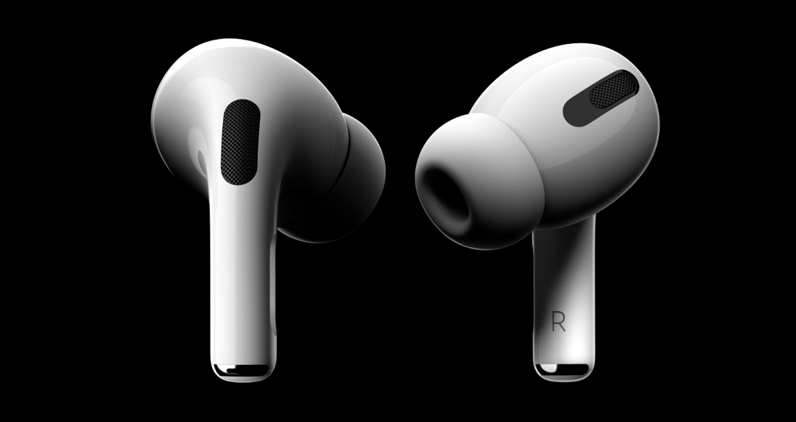

# Future

---

## Where AirPosture Is Going

**Sensors + AI**

    

AirPods now include richer motion and medical-grade heart rate sensors, and Apple’s MLX framework enables private, low-latency AI models on iOS without cloud delays or privacy compromises.

**IR Camera (Late 2026 maybe?)**

    

Looking ahead, top sources (Bloomberg), 郭明錤 (Ming-Chi Kuo), 9to5mac all suggest next-gen AirPods may include infrared (IR) cameras in 2026. This could unlock an entirely new posture ecosystem, using IR scanning through the ear to capture precise body alignment in real time.

This combination of rapidly expanding user base, advanced health sensors, and emerging IR technology makes today the perfect moment for AirPosture.

**macOS**

    

