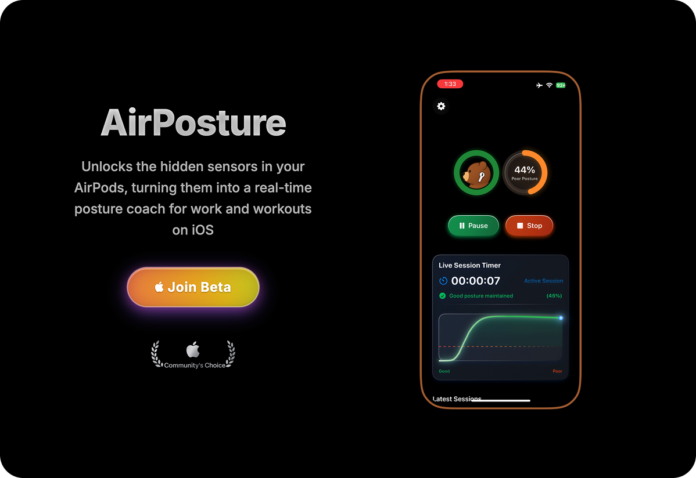

  

<h1 align="center">AirPosture</h1>

  

  
    

    

* **Status:** alpha stage (iOS & macOS 1.0 expected late 2025)

* **Supported Devices** - AirPods Pro (all generations), AirPods (3rd generation and later), AirPods Max, and compatible Beats earphones that support spatial audio with dynamic head tracking. 
  

### ⚠️ Notice

There are some fake “AirPosture” apps that are not mine — they are malicious impersonations attempting to distribute malware built by "Vibe-scammers".

Huge thanks to [Maxdme124](https://www.reddit.com/user/Maxdme124/) for flagging this so quickly. Please stay safe and only download AirPosture from the official links provided here.
