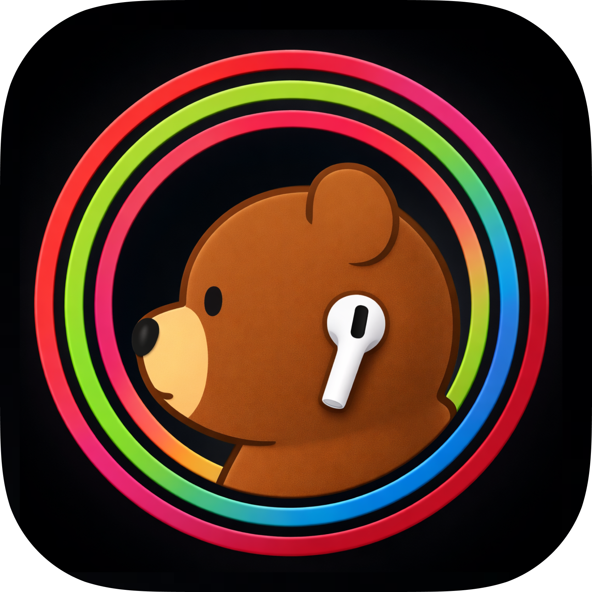
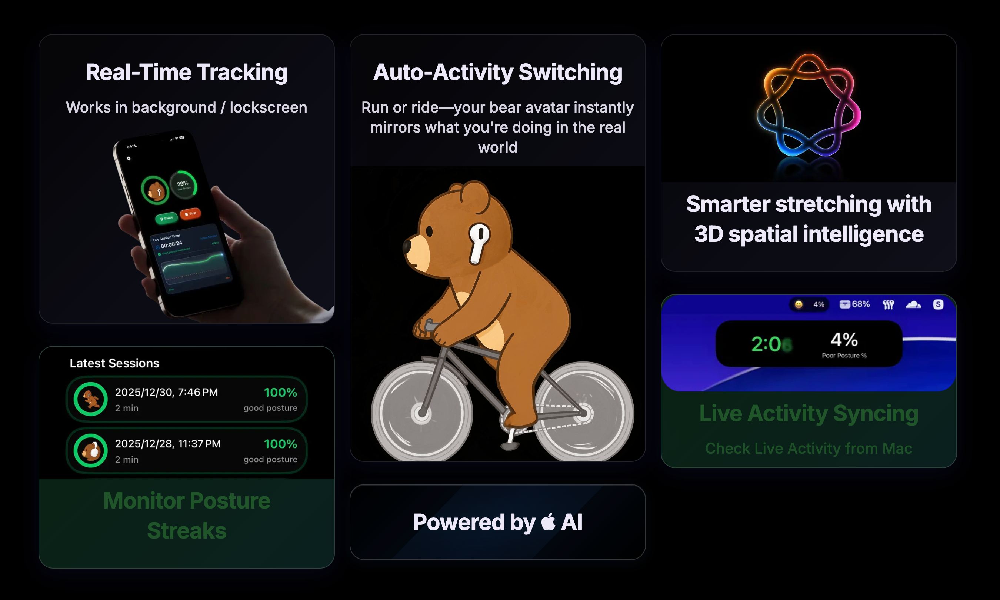

---

  

<h1 align="center">AirPosture</h1>

  

  <a href="https://www.airposture.pro/">

    

    

---

- **Website**: [https://airposture.pro](https://www.airposture.pro/)
- **Status**: Launching April 2026
- **Get Invite**:  Currently public beta’s full. Please [sign up here](https://wormholecompany.notion.site/2904d8b11caf8083957fe98db81d45f6?pvs=105) and I’ll invite you as soon as a slot opens.
- **Supported Devices** - AirPods Pro (all generations), AirPods (3rd generation and later), AirPods Max, and compatible Beats earphones that support spatial audio with dynamic head tracking. 
- **Follow on [X](https://x.com/allenleexyz)**

  

---

### 🚨 Notice

There are some fake "AirPosture" apps on App Store and Github that are not mine — they are malicious impersonations attempting to distribute malware built by "Vibe-scammers". 

Huge thanks to [Maxdme124](https://www.reddit.com/user/Maxdme124/) for flagging this so quickly. Please stay safe and only download AirPosture from the official links provided here.

The code in this repo isn't up to date because these people were misusing it to spam. As promised, I'll share the full source code once the 1.0 version officially launches on the App Store.
