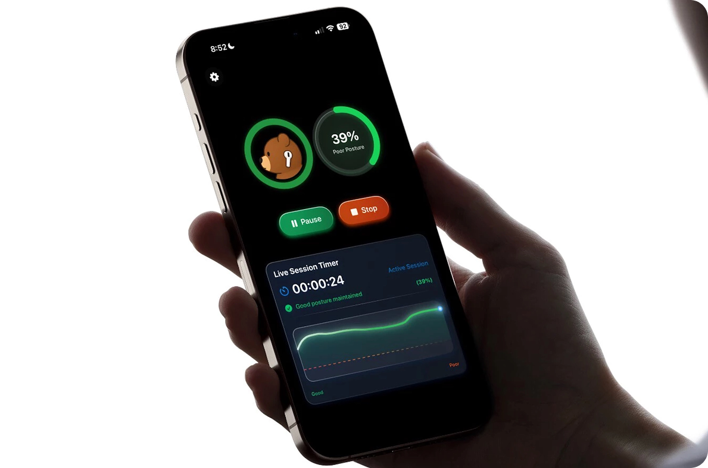

  

<h1 align="center">
  <a href="https://www.airposture.pro/" style="color: inherit; text-decoration: none;">AirPosture</a>
</h1>

    

    

---

- **Supported Devices** - AirPods Pro (all generations), AirPods (3rd generation and later), AirPods Max, and compatible Beats earphones that support spatial audio with dynamic head tracking. 
- **iOS Testflight**: [Download link](https://testflight.apple.com/join/ATvtBUZH)
- **Follow on [X](https://x.com/allenleexyz)**

  

---

## AirPosture is Now Fully Open Source

When I started building AirPosture, I wasn't trying to create another subscription app.

I simply wanted a tool that could help people improve their posture using the devices they already wear every day.

Since the beta launch, AirPosture has been used in over 100,000 sessions by people around the world. Seeing that response forced me to rethink why I was building this project in the first place.

The original plan was to keep developing AirPosture as a commercial product and open source it after version 1.0. But over time, I realized the thing I care about most is not maximizing revenue—it's helping as many people as possible build healthier habits.

### Spammers

In the past few months, I’ve also seen unofficial “AirPosture” apps with aggressive paywalls, as well as online posts that are not affiliated with me or this project. Some have copied the name and branding while distributing modified versions of the original release or directing users to unknown downloads; some of those are malicious impersonations attempting to distribute malware. I reached out to almost all of them asking that they rename the software or take down the malware, but most either dismissively denied my request or ignored it entirely. This situation has even led Apple to repeatedly reject my own app during review, simply because others used the original open-source version and the “AirPosture” name on the App Store.

### Open it 100%

Rather than fighting those people behind closed doors, I've decided to make the project completely transparent.

So today, I'm open sourcing the entire AirPosture codebase.

If AirPosture helps even a small number of people sit better, move better, and feel better, then it has already succeeded.

Thank you to everyone who tested the beta, shared feedback, reported bugs, and supported the project from the beginning.

— Allen Lee

---

> **📖 Setup:** See [TOC.md](TOC.md) for prerequisites, configuration, and build instructions.

---

## License

[MIT License](LICENSE)
