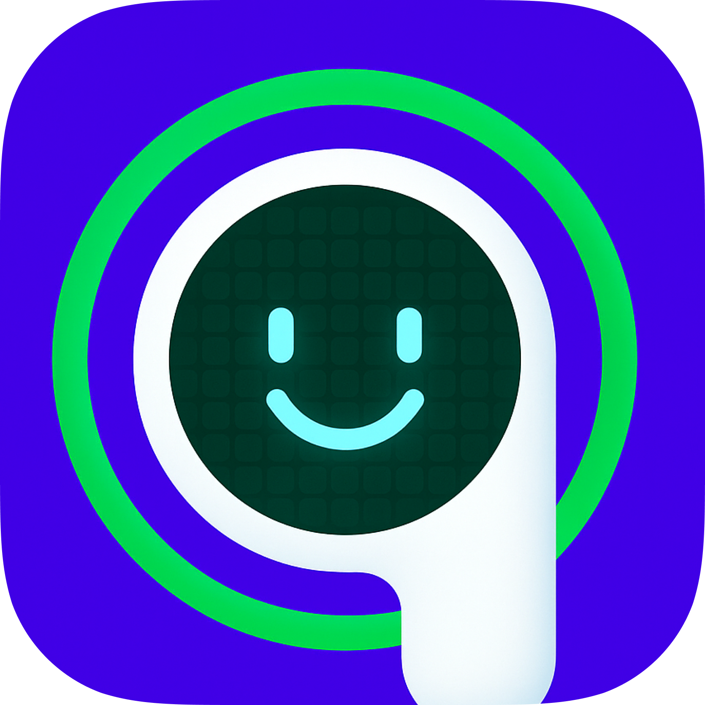

# AirPosture

<p align="center">
  
</p>
<h1 align="center">AirPosture</h1>
<h4 align="center">Turn your AirPods into a posture coach on macOS & iOS. AirPosture uses your AirPods' sensors to catch bad posture in real time.</h4>
<p>

  <br />
  - 🚧 <strong>Status:</strong> Work in progress — the app will be launching soon. Thank you for the support!
  <br />
  - 🧭 <strong>Follow updates on <a href="https://x.com/allenleev0" target="_blank">X</a></strong>
</p>

## Demo

<div align="center">
    
</div>

How to Set Up and Run the Project on macOS

1. **Install Homebrew (if not already installed):**

   ```bash
   /bin/bash -c "$(curl -fsSL https://raw.githubusercontent.com/Homebrew/install/HEAD/install.sh)"
   ```

   Follow the prompts and enter your password when requested.

2. **Add Homebrew to your PATH:**

   ```bash
   echo 'eval "$(/opt/homebrew/bin/brew shellenv)"' >> ~/.zprofile
   eval "$(/opt/homebrew/bin/brew shellenv)"
   ```

3. **Verify Homebrew installation:**

   ```bash
   brew --version
   ```

4. **Install XcodeGen using Homebrew:**

   ```bash
   brew install xcodegen
   ```

5. **Generate the Xcode project from the project configuration file:**

   ```bash
   xcodegen
   ```

6. **Open the generated Xcode project:**

   ```bash
   open AirPostureApp.xcodeproj
   ```

7. **If prompted, download the required iOS 18.4 simulator in Xcode:**

   * Go to `Xcode → Settings → Components`
   * Download the iOS 18.4 Simulator

8. **Update the build destination in Xcode:**

   * In the top-left corner of Xcode, locate the build target selector.
   * Click it and change the destination from “My Mac” to an iOS simulator (e.g., “iPhone 15”).
   * This ensures the app is built and run on an iOS device instead of macOS.

9. **Build and run the app in Xcode** by selecting the desired simulator and clicking the **Run** button.


## Acknowledgments

- Built using [headtracker](https://github.com/ctxzz/HeadTrackerApp)
